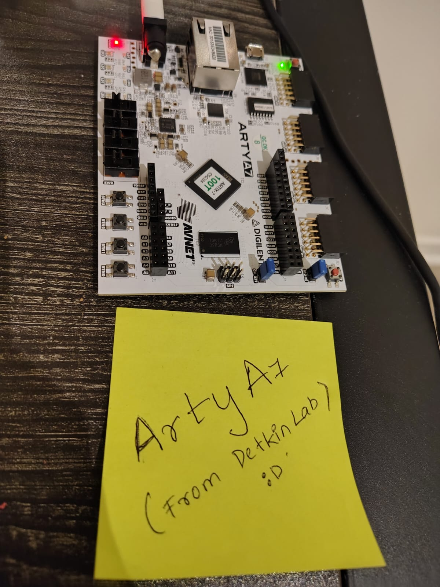

# Systolic Array Accelerator - Xilinx Artix-7


A hardware accelerator built from scratch on an FPGA that performs matrix multiplication using a systolic array - the same fundamental architecture behind Google's TPU and Nvidia's Tensor Cores.

I started this project to understand how ML hardware actually works under the hood, not just use it. If you're curious about the same thing, hopefully this repo is useful.



---

## Background

Every neural network bottlenecks on one operation: matrix multiplication. CPUs do it sequentially. GPUs parallelize it. TPUs take it further - they use a **systolic array**, a grid of tiny multiply-accumulate (MAC) units where data flows directly between neighbors every clock cycle, never going back to memory.

This project implements that idea on a Xilinx Artix-7 FPGA. Small scale, but the architecture is the same.

---

## How it works

The core building block is a **MAC unit**. Every clock cycle it does:

```
acc = acc + (a_in × b_in)
```

It also passes `a_in` to its right neighbor and `b_in` to its bottom neighbor. Wire N² of these in an NxN grid, stagger the inputs correctly, and you get a machine that computes a full NxN matrix multiply in hardware - all output elements accumulating simultaneously.

```
        B col0↓   B col1↓   B col2↓   B col3↓

A row0→ [MAC00] → [MAC01] → [MAC02] → [MAC03]
           ↓          ↓         ↓         ↓
A row1→ [MAC10] → [MAC11] → [MAC12] → [MAC13]
           ↓          ↓         ↓         ↓
A row2→ [MAC20] → [MAC21] → [MAC22] → [MAC23]
           ↓          ↓         ↓         ↓
A row3→ [MAC30] → [MAC31] → [MAC32] → [MAC33]
```

The array is parameterizable up to MAX_N × MAX_N. Smaller matrices are zero-padded at runtime - you just pass in `actual_n` and the hardware handles the rest.

---

## Project structure

```
systolic-array-fpga/
├── src/
│   ├── mac_unit.v                  # MAC processing element
│   └── systolic_array_max.v        # Parameterizable NxN top-level
├── sim/
│   └── systolic_array_max_tb.sv    # Self-checking testbench (all sizes)
├── images/
│   └── board.jpeg
└── README.md
```

---

## Simulation results

Tested across four matrix sizes in a single simulation run. All use A × I = A (identity matrix) for easy verification.

```
---- Test 2x2  ----   All PASS ✓
---- Test 4x4  ----   All PASS ✓
---- Test 8x8  ----   All PASS ✓
---- Test 16x16 ---   All PASS ✓
```

Simulated in Vivado xsim 2025.1 and EDA Playground.

---

## Raspberry Pi Integration (in progress)

The end goal is a heterogeneous computing demo where a **Raspberry Pi** runs an image processing pipeline and offloads the matrix multiplication to the FPGA over UART.

```
[Raspberry Pi]                        [Arty A7 FPGA]
  Load image
  Extract convolution matrix
  Send matrix + size over UART  →     Systolic array computes C = A×B
  Receive result                ←     Send result back
  Apply to image
  Print: CPU time vs FPGA time
```

The Pi handles high-level logic - loading images, tiling large matrices, reassembling results. The FPGA does one thing: multiply matrices really fast. This mirrors how real heterogeneous systems work, like Nvidia's Drive AGX platform used in autonomous vehicles.

**Known tradeoff:** UART runs at ~115200 baud which limits transfer speed for large matrices. A future improvement would be swapping to SPI for significantly lower transfer overhead.

---

## Running it yourself

You'll need Vivado ML Edition (free) - Windows or Linux only - and an Arty A7 board.

1. Clone the repo
   ```bash
   git clone https://github.com/ananya473/systolic-array-fpga.git
   ```
2. Open Vivado, create a project targeting `xc7a35ticsg324-1L`
3. Add `src/mac_unit.v` and `src/systolic_array_max.v` as design sources
4. Add `sim/systolic_array_max_tb.sv` as a simulation source
5. Run Behavioral Simulation and check the TCL console

To test on EDA Playground, paste both `mac_unit` and `systolic_array_max` into `design.sv` (mac_unit first), and the testbench into `testbench.sv`.

---

## What's next

- [x] MAC unit design and simulation
- [x] Parameterizable NxN systolic array
- [x] Variable runtime matrix size with zero padding
- [x] Self-checking testbench - passes 2×2, 4×4, 8×8, 16×16
- [ ] Synthesize on Arty A7, check resource utilization
- [ ] UART interface for host communication
- [ ] Raspberry Pi image processing integration
- [ ] End-to-end benchmark: CPU time vs FPGA time

---

## References

- Kung, H.T. (1982). *Why Systolic Architectures?* - IEEE Computer
- Jouppi et al. (2017). *In-Datacenter Performance Analysis of a Tensor Processing Unit* - Google

---

**Ananya Shivarama Bhat** - MSE ESE, University of Pennsylvania  
[LinkedIn](https://www.linkedin.com/in/ananya473/) · [Portfolio](https://ananyabhat.framer.website/)
